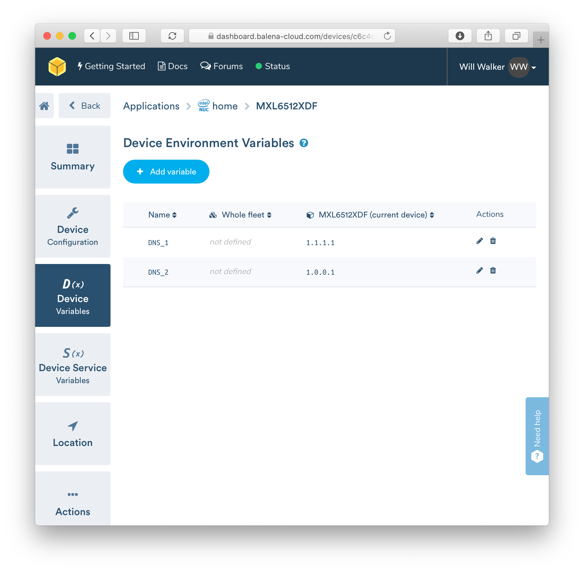

# balenaDNS

Although you can set your own custom DNS servers on balenaCloud devices, it is [only](https://www.balena.io/docs/reference/OS/network/2.x/#setting-a-static-ip) when flashing a device (or when you have physical access to said device). In many cases (including my own), this is too much trouble when you have a fleet of 50+ devices that would otherwise require physical access. Rather than having to touch each device inside your application, I offer to you a solution where you can: **set custom DNS servers (for the HostOS, and subsequently all containers) on balena devices during runtime (after provisioning)**.  All it takes is a quick clone of this repo, setting some environment variables, and you're good to go. 

## Installation

Clone this repository to your local workspace:

```bash
git clone https://github.com/willswire/balenaDNS.git
```

Add/merge the `docker-compose.yml` file and the `networking` folder to your multicontainer setup. If you aren't using a multicontainer setup, but would like to add this container, see Balena's [documentation](https://www.balena.io/docs/learn/develop/multicontainer/) for more information.

This project can also run on its own if you would like to use it for testing purposes. After cloning, push it to your application of choice via the [balena-cli](https://github.com/balena-io/balena-cli/blob/master/INSTALL.md):

```bash
balena push myApplication
```

## Usage

After installation, you will need to set some environment variables at either the device level, or the entire application level. See Balena's documentation on communication outside the container.

| Name    | Value                                                        |
| ------- | ------------------------------------------------------------ |
| `DNS_1` | `1.1.1.1` _[the primary ip address of your preferred DNS server]_ |
| `DNS_2` | `1.0.0.1` _[the secondary ip address of your preferred DNS server]_ |



## Contributing

Pull requests are welcome. For major changes, please open an issue first to discuss what you would like to change. Please report any issues you come accross. I've tested this project on amd64 and arm architectures.

## Resources
- [IP to Unsigned Int](http://www.aboutmyip.com/AboutMyXApp/IP2Integer.jsp)
- [IP Address to Array](https://www.tutorialkart.com/bash-shell-scripting/bash-split-string/)
- [dnsmasq DBUS Interface](http://www.thekelleys.org.uk/dnsmasq/docs/DBus-interface)
- [dbus-send](https://dbus.freedesktop.org/doc/dbus-send.1.html)
